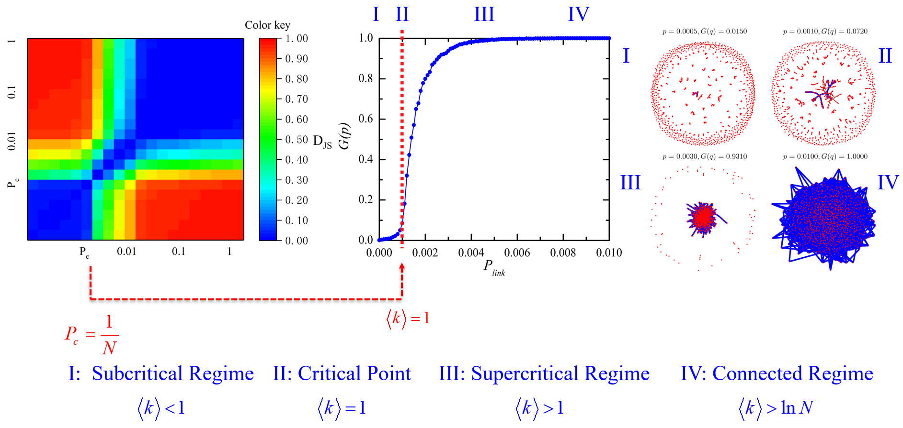

I am a PhD candidate with a strong interest in network science and machine learning, and my research interests involve renormalization and robustness of complex networks, social networks, information science, and graph neural networks.

I received my M.S. degree in Circuits and Systems from [Hubei University](https://www.hubu.edu.cn/), Wuhan, China, in 2019. Currently, I am pursuing a PhD degree in artificial intelligence from the School of Artificial Intelligence and Automation, [Huazhong University of Science and Technology](https://www.hust.edu.cn/), Wuhan, China.

My other academic homepages: 
[Github1](https://github.com/chend2023) / [Github2](https://github.com/dange-academic) / [ResearchGate](https://www.researchgate.net/profile/Dan-Chen-29) / [Google Scholar](https://scholar.google.com/citations?user=Qm2XMekAAAAJ&hl=zh-CN)  

Featured Publications
======
### [Scaling Properties of Scale-Free Networks in Degree-Thresholding Renormalization Flows](https://ieeexplore.ieee.org/abstract/document/10100895) 
D. Chen, D. Cai and H. Su, IEEE Transactions on Network Science and Engineering, 2023, 10(6): 3519-3528, Nov.-Dec. 2023. 
Code is available at [Code](https://github.com/cdzqf/DTR).
 

### [Geometric Renormalization Reveals the Self-Similarity of Weighted Networks](https://ieeexplore.ieee.org/abstract/document/9761989) 
D. Chen, H. Su and Z. Zeng, IEEE Transactions on Computational Social Systems, 2023, 10(2): 426-434, April 2023.
 

### [Identification of Network Topology Variations Based on Spectral Entropy](https://ieeexplore.ieee.org/abstract/document/9409704) 
H. Su, D. Chen, G. -J. Pan, et al. IEEE Transactions on Cybernetics, 2022, 52(10): 10468-10478, Oct. 2022. 
Code is available at [Code](https://github.com/cdzqf/Spectral-entropy).
 

### [Finite-size scaling of geometric renormalization flows in complex networks](https://journals.aps.org/pre/abstract/10.1103/PhysRevE.104.034304) 
Dan Chen, Housheng Su, Xiaofan Wang, et al. Phys. Rev. E, 2021, 104(3): 034304.
 

### [Framework based on communicability to measure the similarity of nodes in complex networks](https://www.sciencedirect.com/science/article/abs/pii/S0020025520302279) 
Dan Chen, Housheng Su, Gui-Jun Pan. Information Sciences, 2020, 524 (2020): 241–253.
 

### [Characterization of network complexity by communicability sequence entropy and associated Jensen-Shannon divergence](https://journals.aps.org/pre/abstract/10.1103/PhysRevE.101.042305) 
Dan-Dan Shi, Dan Chen, and Gui-Jun Pan. Phys. Rev. E, 2020, 101(4): 042305.
 

### [Correlations between communicability sequence entropy and transport performance in spatially embedded networks](https://journals.aps.org/pre/abstract/10.1103/PhysRevE.99.062310) 
Dan Chen, Rui-Wu Niu, and Gui-Jun Pan. Phys. Rev. E, 2019, 99(6): 062310.
 

### [Complex network comparison based on communicability sequence entropy](https://journals.aps.org/pre/abstract/10.1103/PhysRevE.98.012319) 
Dan Chen, Dan-Dan Shi, Mi Qin, et al. Phys. Rev. E, 2018, 98(1): 012319.
 
