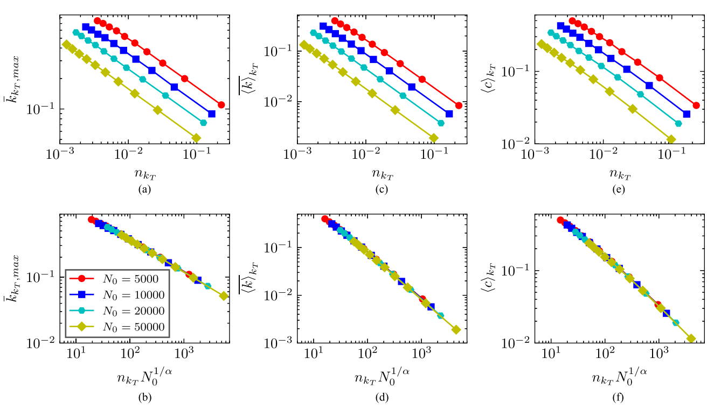

## New paper in IEEE Transactions on Network Science and Engineering [Scaling Properties of Scale-Free Networks in Degree-Thresholding Renormalization Flows](https://ieeexplore.ieee.org/abstract/document/10100895) 
 
### Renormalization is useful for transforming large networks into smaller ones, and degree-thresholding renormalization (DTR) is especially simple and convenient in this regard. We find some structural and dynamical observables of synthetic and real scale-free networks with similar scaling behavior in the DTR flow. The finite-size scaling analysis confirms this view and reveals a scaling function with a single exponent that collectively captures the variation of these observables. 

